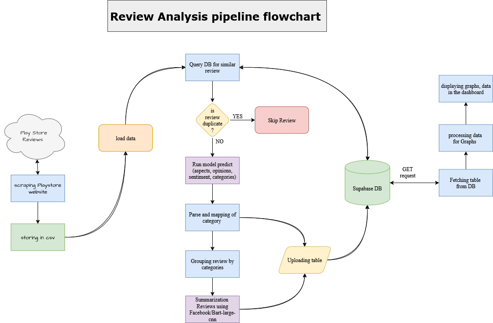

# 📊 Customer Experience Analysis in Banking Reviews

A project completed during my internship at **State Bank of Pakistan (SBP)** under the **IT Programs and Project Management Department**, focused on analyzing user feedback from mobile banking apps using **Aspect-Based Sentiment Analysis (ABSA)** and **NLP-based summarization**.

## 📌 Project Overview

This system automates the analysis of **8,000+ Play Store reviews** from major Pakistani banking apps to extract:

- ✅ User **aspects** (topics like UI, login, speed)
- ✅ **Opinion phrases** and **sentiment** (positive/negative/neutral)
- ✅ Mapping to **banking-relevant categories**
- ✅ Concise **summaries** per category using NLP

The goal is to help product and IT teams **understand customer experience at scale** and identify recurring app issues like login failures, poor UI, and transaction delays.

## 🛠️ Features

- 🔄 Automatic review collection using `google-play-scraper`
- 🧠 Aspect-Based Sentiment Analysis using **PyABSA**
- ✍️ Review summarization using **Facebook's BART model**
- 📂 Deduplication and category mapping
- 📊 Frontend dashboard for visual insights *(by frontend collaborator)*
- 🔗 Backend built with Python; data stored in Firebase

---

## 🧪 Project Pipeline

---

## 🧰 Technologies Used

- **Python** (backend logic & NLP)
- **PyABSA** – ABSA Model
- **HuggingFace Transformers** – BART summarizer
- **Firebase** – Database & syncing
- **React + Tailwind CSS** – Frontend dashboard *(developed by teammate)*
- **Pandas, Numpy, JSON** – Data handling

## 📸 Dashboard Preview

🌐 [Live Dashboard Link](https://payallkumari.github.io/Sentiment-Analysis)  
💻 [Frontend GitHub Repo](https://github.com/Payallkumari/Sentiment-Analysis)

## 🔗 Repositories

- 🔙 Backend (this repo): `absa-bank-analyzer` – [Uzair's GitHub](https://github.com/Uzair-A-Jokhio/absa-bank-analyzer)
- 🎨 Frontend (dashboard): [Payal Kumari's Repo](https://github.com/Payallkumari/Sentiment-Analysis)

## 👥 Team

- **Uzair A. Jokhio** – Backend & Model Integration 
- **Payal Kumari** – Frontend Dashboard Development 

👨‍🏫 **Mentor**: Mr. Naveed Akthar (ITSM specialist) 
📍 Organization: State Bank of Pakistan – IT Programs & Project Management Department

---